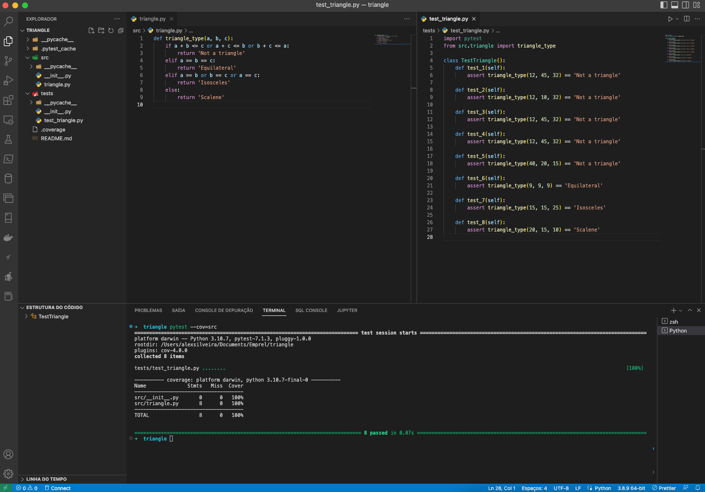
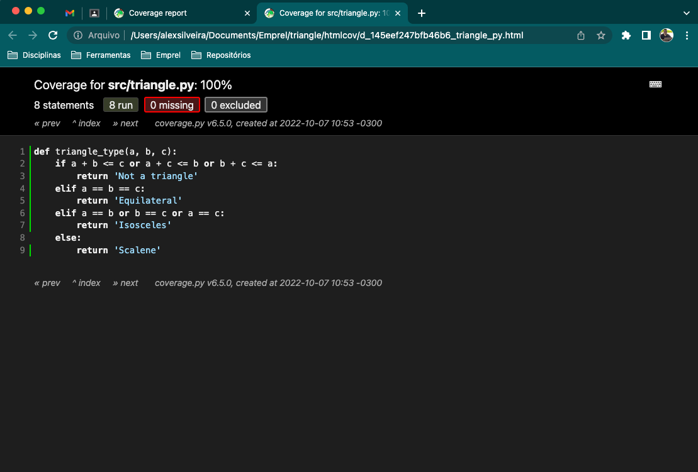

# Exercício - Teste de Cobertura

## Classe **triangle**

```python
def triangle_type(a, b, c):
    if a + b <= c or a + c <= b or b + c <= a:
        return 'Not a triangle'
    elif a == b == c:
        return 'Equilateral'
    elif a == b or b == c or a == c:
        return 'Isosceles'
    else:
        return 'Scalene'
```
## Classe de teste **test_triangle**

```python
import pytest
from src.triangle import triangle_type

class TestTriangle():
    def test_1(self):
        assert triangle_type(12, 45, 32) == 'Not a triangle'

    def test_2(self):
        assert triangle_type(12, 10, 32) == 'Not a triangle'

    def test_3(self):
        assert triangle_type(12, 45, 32) == 'Not a triangle'

    def test_4(self):
        assert triangle_type(12, 45, 32) == 'Not a triangle'

    def test_5(self):
        assert triangle_type(40, 20, 15) == 'Not a triangle'

    def test_6(self):
        assert triangle_type(9, 9, 9) == 'Equilateral'

    def test_7(self):
        assert triangle_type(15, 15, 25) == 'Isosceles'

    def test_8(self):
        assert triangle_type(20, 15, 10) == 'Scalene'

```


## Execução do teste de cobertura
` pytest --cov=src `


## Resultado do teste



## Execução do teste de cobertura coverage
` coverage html `


## Resultado do teste

